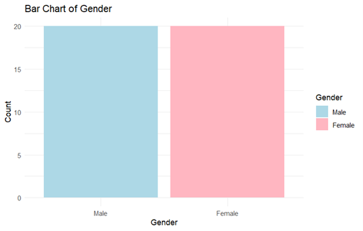
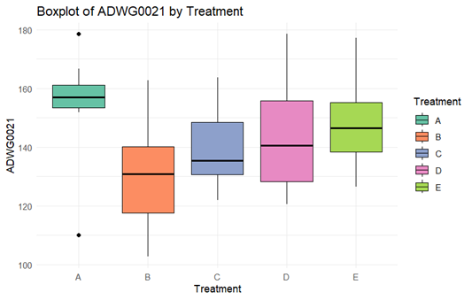
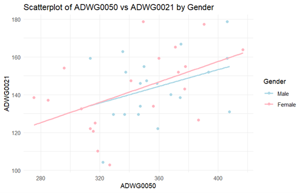
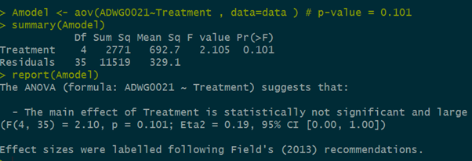
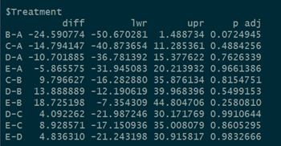

# 🐖 Biostatistics Project: Evaluating Treatments for Post-Weaning Diarrhea in Piglets

## 📋 Overview

This project investigates alternatives to Zinc Oxide (ZnO) for preventing **Post-Weaning Diarrhea (PWD)** in piglets. Due to growing concerns over **antibiotic resistance** and **environmental contamination**, ZnO was banned by the EU in 2022. Our goal is to evaluate different treatments and their effect on piglet growth, measured via **Average Daily Weight Gain (ADWG)**.

---

## 🎯 Objective

To compare the effectiveness of 5 treatment strategies (A–E) on piglet growth during three periods:
- `ADWG0021`: Days 0–21 post-weaning
- `ADWG2150`: Days 21–50 post-weaning
- `ADWG0050`: Days 0–50 post-weaning

---

## 🧪 Treatments Compared

| Label | Treatment Description |
|-------|------------------------|
| A     | Normal feed + ZnO (baseline) |
| B     | Normal feed + nutraceuticals |
| C     | Vaccination + high energy/protein in phases 2 and 3 |
| D     | Vaccination + high energy/protein in phases 1–3 |
| E     | Vaccination + high energy/protein in phases 1–3 + nutraceuticals |

---

## 📊 Dataset Summary

- **Sample Size**: 40 pens (8 pens per treatment, 16 piglets per pen)
- **Observation Level**: Pen-level (not individual piglets)
- **Design**: Balanced across gender and treatments
- **Clean Data**: No missing or negative values

---

## 📈 Key Visualizations

> Be sure to include these visualizations as `.png` files in a `/images` folder and reference them like:
> ``

### 1. Gender Distribution
Balanced representation of males and females.



---


### 2. Histogram of ADWG0021 and ADWG2150
Distribution shapes and spread across individuals.


---

### 3. Boxplots of ADWG0021
- Overall distribution
- Comparison across treatments




---

### 4. Correlation: ADWG0021 vs ADWG0050 by Sex
Strong positive correlation, indicating early weight gain predicts total gain.



---

### 5. Statistical Testing Visuals
- Normality & variance tests
- ANOVA and Kruskal-Wallis results
- Post-hoc comparisons

> Example:
> 
> 

---

## 📊 Statistical Insights

- **Normality**: Shapiro-Wilk test & Q-Q plots suggest data is normally distributed.
- **Homoscedasticity**: Levene and Bartlett tests confirm equal variances.
- **No Significant Gender Difference**: Linear regression and t-tests show no significant difference in ADWG0021 between males and females.
- **Treatment Effect**:
  - Treatment A and E show highest ADWG0021.
  - Treatment B has the lowest.
  - ANOVA and Kruskal-Wallis indicate **no significant differences** overall, but pairwise comparison (B vs A) showed a significant result.

---

## 🔍 Linear Regression Summary

- **Model**: `ADWG0021 ~ Sex`
- **Coefficient (Sex=2 vs Sex=1)**: -1.92 (not significant)
- **95% CI**: [-14.32, 10.48]
- **Conclusion**: Gender does not significantly affect early growth.

---

## 💡 How to Use This Project

1. Clone the repository:
   ```bash
   git clone https://github.com/yourusername/piglets-biostat-project.git
   cd piglets-biostat-project
